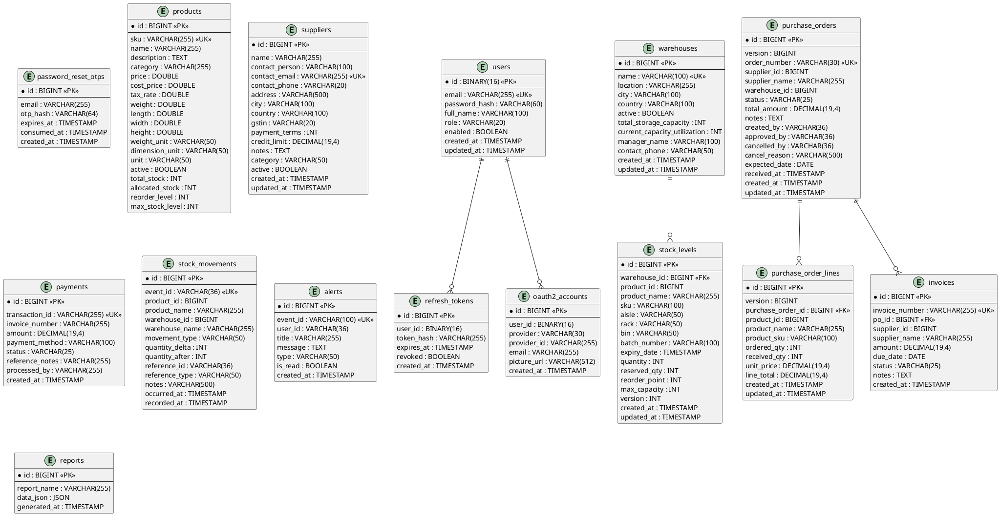
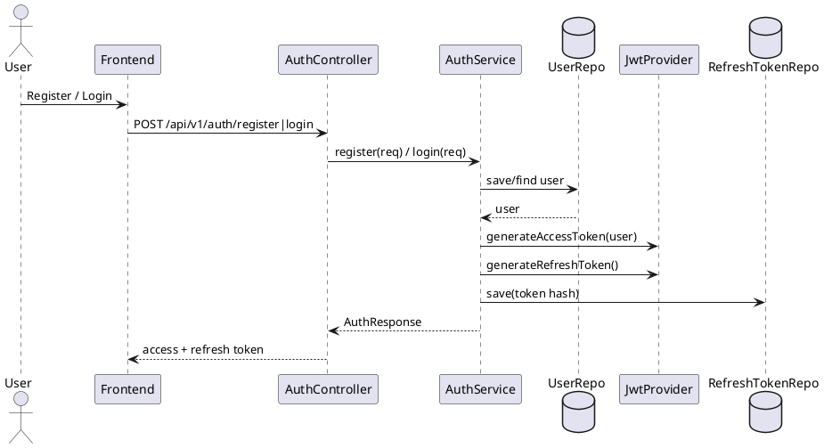
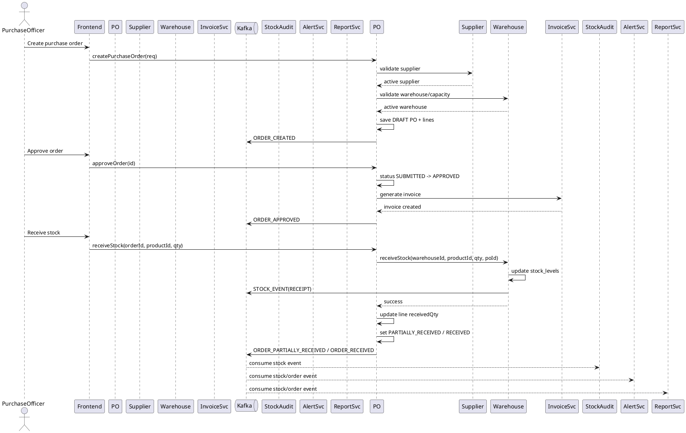
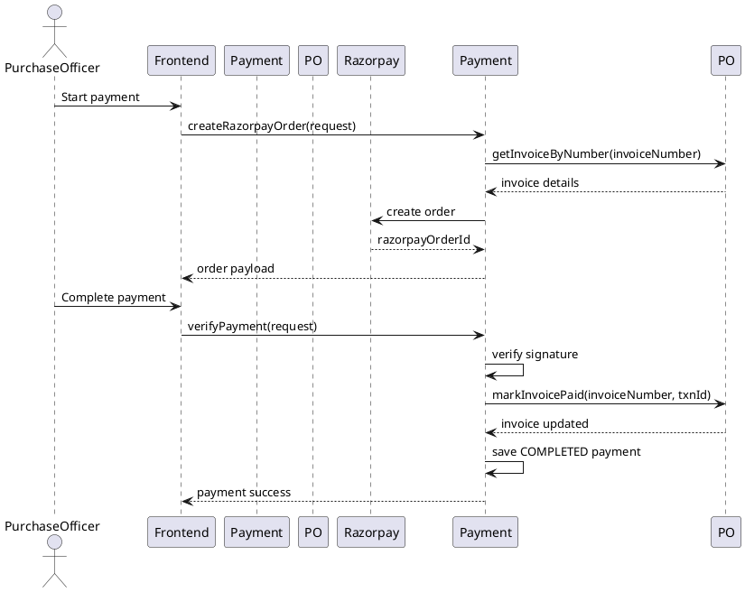
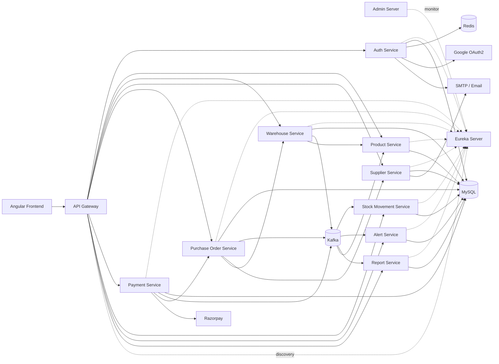

# WareX System Design

## Overview

WareX is a microservices-based inventory and procurement platform built around these business services:

- `auth-service`
- `product-service`
- `warehouse-service`
- `supplier-service`
- `purchase-order-service`
- `payment-service`
- `stock-movement-service`
- `alert-service`
- `report-service`
- `frontend`

Infrastructure services present in the repo:

- `api-gateway`
- `eureka-server`
- `admin-server`

Repository layout:

- `backend/` contains all Spring Boot services, infrastructure manifests, Sonar config, logs, and backend helper scripts
- `frontend/` contains the Angular application

Primary user roles from the code:

- `ADMIN`
- `INVENTORY_MANAGER`
- `PURCHASE_OFFICER`
- `WAREHOUSE_STAFF`

Core capabilities implemented:

- JWT and OAuth2 authentication
- Role-based access control
- Product master and inventory metadata
- Warehouse and stock operations
- Supplier management
- Purchase-order lifecycle and invoice generation
- Payment processing with Razorpay and manual flows
- Kafka-based stock movement auditing
- Alerts and reporting

## Diagram Files

Curated diagram pack:

- [Architecture Diagram](./diagrams/core/architecture.mmd)
- [Class Diagram](./diagrams/core/class-diagram.puml)
- [ER Diagram](./diagrams/core/er-diagram.puml)
- [Identity Flows](./diagrams/flows/identity-flows.puml)
- [Operations Flows](./diagrams/flows/operations-flows.puml)
- [Lifecycle States](./diagrams/states/lifecycle-states.puml)

## Architect Summary

Use these 3 diagrams for architecture reviews and explanations:

- [Architecture Overview](./diagrams/summary/architecture-overview.mmd)
- [Core Domain ERD](./diagrams/summary/core-domain-erd.puml)
- [Procurement Runtime Flow](./diagrams/summary/procurement-runtime-flow.puml)

## Service Boundaries

| Service | Responsibility |
|---|---|
| `auth-service` | Identity, roles, JWT, refresh token rotation, OAuth2, password reset |
| `product-service` | Product catalog, dimensions, pricing, stock metadata |
| `warehouse-service` | Warehouses, stock levels, reservations, transfers, stock adjustments |
| `supplier-service` | Supplier master data and supplier activation lifecycle |
| `purchase-order-service` | Procurement workflow, PO states, PO lines, invoice generation |
| `payment-service` | Invoice payment validation, payment records, Razorpay integration |
| `stock-movement-service` | Immutable audit trail of stock movement events |
| `alert-service` | Event-driven alerts and user notifications |
| `report-service` | Aggregated reports and dashboard data |
| `frontend` | Angular UI for all operational workflows |

## Synchronous Inter-Service Communication

In addition to Kafka-based asynchronous events, this project uses **OpenFeign** heavily for synchronous service-to-service calls.

Main Feign paths in the repo:

- `purchase-order-service -> supplier-service`
  Validates supplier existence and active status before PO creation.
- `purchase-order-service -> warehouse-service`
  Validates warehouse state and triggers stock receipt on PO receiving.
- `supplier-service -> purchase-order-service`
  Checks whether supplier deactivation is blocked by active POs or invoices.
- `payment-service -> purchase-order-service`
  Validates invoice state before payment and marks invoice paid afterward.
- `warehouse-service -> product-service`
  Enriches local stock snapshots with product name and SKU.
- `stock-movement-service -> product-service`
  Enriches movement views with product metadata.
- `stock-movement-service -> warehouse-service`
  Resolves warehouse display details.
- `stock-movement-service -> purchase-order-service`
  Resolves invoice and PO context for movement views.
- `stock-movement-service -> payment-service`
  Resolves latest payment details by invoice number.

This means the design has a clear split:

- **Feign** for synchronous validation, lookup, and command-style internal RPC
- **Kafka** for asynchronous audit, projection, alerting, and reporting

The curated diagrams intentionally fold those Feign and Kafka relationships into the high-level architecture and operations flow views so the documentation stays complete without fragmenting into too many files.

## Class Diagram

This diagram focuses on the core aggregates and orchestration classes that are actually represented in the repo.

```plantuml
@startuml
skinparam classAttributeIconSize 0
hide empty methods

package "Auth Service" {
  enum Role {
    ADMIN
    INVENTORY_MANAGER
    PURCHASE_OFFICER
    WAREHOUSE_STAFF
  }

  class User {
    +id: UUID
    +email: String
    +passwordHash: String
    +fullName: String
    +role: Role
    +enabled: boolean
    +createdAt: Instant
    +updatedAt: Instant
  }

  class RefreshToken {
    +id: Long
    +userId: UUID
    +tokenHash: String
    +expiresAt: Instant
    +revoked: boolean
    +createdAt: Instant
  }

  class PasswordResetOtp {
    +id: Long
    +email: String
    +otpHash: String
    +expiresAt: Instant
    +consumedAt: Instant
    +createdAt: Instant
  }

  class OAuth2Account {
    +id: Long
    +userId: UUID
    +provider: String
    +providerId: String
    +email: String
    +pictureUrl: String
    +createdAt: Instant
  }

  class AuthService {
    +register(req): AuthResponse
    +login(req): AuthResponse
    +refresh(req): AuthResponse
    +logout(token, userId): void
    +getMe(userId): UserInfoResponse
    +disableUser(userId): void
    +enableUser(userId): void
    +updateUserRole(userId, role): void
  }
}

package "Product Service" {
  class Product {
    +id: Long
    +sku: String
    +name: String
    +description: String
    +category: String
    +price: Double
    +costPrice: Double
    +taxRate: Double
    +weight: Double
    +length: Double
    +width: Double
    +height: Double
    +weightUnit: String
    +dimensionUnit: String
    +unit: String
    +active: boolean
    +totalStock: Integer
    +allocatedStock: Integer
    +reorderLevel: Integer
    +maxStockLevel: Integer
  }
}

package "Supplier Service" {
  class Supplier {
    +id: Long
    +name: String
    +contactPerson: String
    +contactEmail: String
    +contactPhone: String
    +address: String
    +city: String
    +country: String
    +gstin: String
    +paymentTerms: Integer
    +creditLimit: BigDecimal
    +notes: String
    +category: String
    +active: Boolean
    +createdAt: Instant
    +updatedAt: Instant
  }
}

package "Warehouse Service" {
  class Warehouse {
    +id: Long
    +name: String
    +location: String
    +city: String
    +country: String
    +active: boolean
    +totalStorageCapacity: Integer
    +currentCapacityUtilization: Integer
    +managerName: String
    +contactPhone: String
    +createdAt: Instant
    +updatedAt: Instant
  }

  class StockLevel {
    +id: Long
    +productId: Long
    +productName: String
    +sku: String
    +aisle: String
    +rack: String
    +bin: String
    +batchNumber: String
    +expiryDate: Instant
    +quantity: int
    +reservedQty: int
    +reorderPoint: int
    +maxCapacity: Integer
    +version: int
    +createdAt: Instant
    +updatedAt: Instant
    +getAvailableQuantity(): int
    +isLowStock(): boolean
    +isOverstock(): boolean
  }

  class StockService {
    +initializeStock(...): StockLevelResponse
    +adjustStock(...): StockLevelResponse
    +receiveStock(...): StockLevelResponse
    +transferStock(req): void
    +reserveStock(...): StockLevelResponse
    +releaseReservation(...): StockLevelResponse
  }
}

package "Purchase Order Service" {
  enum PurchaseOrderStatus {
    DRAFT
    SUBMITTED
    APPROVED
    PARTIALLY_RECEIVED
    RECEIVED
    CANCELLED
  }

  class PurchaseOrder {
    +id: Long
    +version: Long
    +orderNumber: String
    +supplierId: Long
    +supplierName: String
    +warehouseId: Long
    +status: PurchaseOrderStatus
    +totalAmount: BigDecimal
    +notes: String
    +createdBy: String
    +approvedBy: String
    +cancelledBy: String
    +cancelReason: String
    +expectedDate: LocalDate
    +receivedAt: Instant
    +createdAt: Instant
    +updatedAt: Instant
    +addLine(line): void
    +recalculateTotal(): void
    +isFullyReceived(): boolean
    +isPartiallyReceived(): boolean
  }

  class PurchaseOrderLine {
    +id: Long
    +version: Long
    +productId: Long
    +productName: String
    +productSku: String
    +orderedQty: int
    +receivedQty: int
    +unitPrice: BigDecimal
    +lineTotal: BigDecimal
    +createdAt: Instant
    +updatedAt: Instant
    +recalculateLineTotal(): void
    +isFullyReceived(): boolean
    +getRemainingQty(): int
  }

  class Invoice {
    +id: Long
    +invoiceNumber: String
    +supplierId: Long
    +supplierName: String
    +amount: BigDecimal
    +dueDate: LocalDate
    +status: InvoiceStatus
    +notes: String
    +createdAt: Instant
  }

  class PurchaseOrderService {
    +createPurchaseOrder(req, createdBy): PurchaseOrderResponse
    +submitOrder(id, userId): PurchaseOrderResponse
    +approveOrder(id, approver): PurchaseOrderResponse
    +receiveStock(id, req, userId): PurchaseOrderResponse
    +cancelOrder(id, reason, userId): PurchaseOrderResponse
  }
}

package "Payment Service" {
  class Payment {
    +id: Long
    +transactionId: String
    +invoiceNumber: String
    +amount: BigDecimal
    +paymentMethod: String
    +status: PaymentStatus
    +referenceNotes: String
    +processedBy: String
    +createdAt: Instant
  }

  class PaymentService {
    +createRazorpayOrder(req): RazorpayOrderResponse
    +verifyPayment(req, username): PaymentResponse
    +processPayment(req, username): PaymentResponse
  }
}

package "Audit / Notification / Reporting" {
  class StockMovement {
    +id: Long
    +eventId: String
    +productId: Long
    +productName: String
    +warehouseId: Long
    +warehouseName: String
    +movementType: MovementType
    +quantityDelta: int
    +quantityAfter: int
    +referenceId: String
    +referenceType: String
    +notes: String
    +occurredAt: Instant
    +recordedAt: Instant
  }

  class Alert {
    +id: Long
    +eventId: String
    +userId: String
    +title: String
    +message: String
    +type: String
    +isRead: boolean
    +createdAt: Instant
  }

  class ReportData {
    +id: Long
    +reportName: String
    +dataJson: String
    +generatedAt: Instant
  }
}

User "1" o-- "0..*" RefreshToken
User "1" o-- "0..*" OAuth2Account
Warehouse "1" *-- "0..*" StockLevel
PurchaseOrder "1" *-- "1..*" PurchaseOrderLine
PurchaseOrder "1" o-- "0..*" Invoice

PurchaseOrderService ..> Supplier
PurchaseOrderService ..> Warehouse
PurchaseOrderService ..> StockService
StockService ..> Product
PaymentService ..> Invoice
StockService ..> StockMovement
@enduml
```

## ER Diagram

This repo uses service-owned schemas. Many cross-service references are stored as IDs or business keys instead of database foreign keys.

## Sequence Diagrams

### 1. User Registration and Login

### 2. Purchase Order Approval and Stock Receipt

### 3. Payment Processing

## Architecture Diagram

This is the best rendered in Mermaid because it is easier to keep readable in Markdown.

## Database Schema Summary

### Auth Service

- `users(id PK, email UK, password_hash, full_name, role, enabled, created_at, updated_at)`
- `refresh_tokens(id PK, user_id, token_hash, expires_at, revoked, created_at)`
- `oauth2_accounts(id PK, user_id, provider, provider_id, email, picture_url, created_at)`
- `password_reset_otps(id PK, email, otp_hash, expires_at, consumed_at, created_at)`

### Product Service

- `products(id PK, sku UK, name, description, category, price, cost_price, tax_rate, weight, length, width, height, weight_unit, dimension_unit, unit, active, total_stock, allocated_stock, reorder_level, max_stock_level)`

### Supplier Service

- `suppliers(id PK, name, contact_person, contact_email UK, contact_phone, address, city, country, gstin, payment_terms, credit_limit, notes, category, active, created_at, updated_at)`

### Warehouse Service

- `warehouses(id PK, name UK, location, city, country, active, total_storage_capacity, current_capacity_utilization, manager_name, contact_phone, created_at, updated_at)`
- `stock_levels(id PK, warehouse_id FK, product_id, product_name, sku, aisle, rack, bin, batch_number, expiry_date, quantity, reserved_qty, reorder_point, max_capacity, version, created_at, updated_at)`

### Purchase Order Service

- `purchase_orders(id PK, version, order_number UK, supplier_id, supplier_name, warehouse_id, status, total_amount, notes, created_by, approved_by, cancelled_by, cancel_reason, expected_date, received_at, created_at, updated_at)`
- `purchase_order_lines(id PK, version, purchase_order_id FK, product_id, product_name, product_sku, ordered_qty, received_qty, unit_price, line_total, created_at, updated_at)`
- `invoices(id PK, invoice_number UK, po_id FK, supplier_id, supplier_name, amount, due_date, status, notes, created_at)`

### Payment Service

- `payments(id PK, transaction_id UK, invoice_number, amount, payment_method, status, reference_notes, processed_by, created_at)`

### Stock Movement Service

- `stock_movements(id PK, event_id UK, product_id, product_name, warehouse_id, warehouse_name, movement_type, quantity_delta, quantity_after, reference_id, reference_type, notes, occurred_at, recorded_at)`

### Alert Service

- `alerts(id PK, event_id UK, user_id, title, message, type, is_read, created_at)`

### Report Service

- `reports(id PK, report_name, data_json, generated_at)`

## Design Notes

- Each service owns its own data model and persistence boundary.
- Cross-service references are mostly stored as IDs or business keys instead of physical foreign keys.
- Snapshot fields such as `supplier_name`, `product_name`, `product_sku`, and `warehouse_name` are intentionally denormalized for read efficiency.
- `warehouse-service` and `purchase-order-service` use optimistic locking to protect concurrent updates.
- Kafka is central to auditability and downstream projections:
  - stock movement history
  - alerts
  - reporting
- `purchase-order-service` is the main orchestration point for procurement flows.
- `warehouse-service` is the source of truth for stock quantities and reservations.
- `payment-service` validates invoice state against procurement before accepting payment.
